# Workflow Notes

## Step1: setting up environment for testing


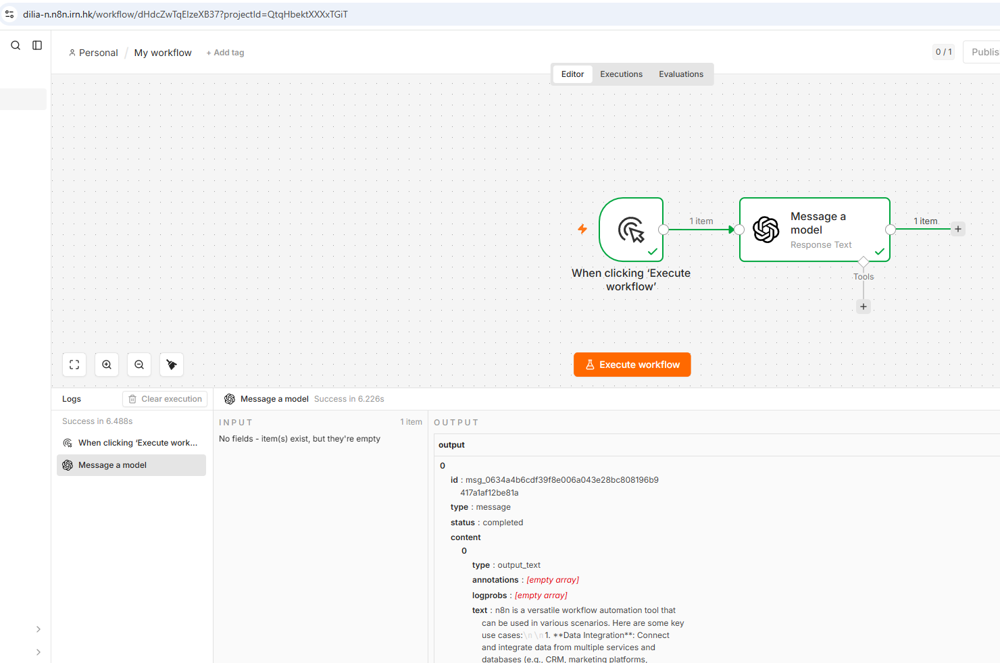

## Step2: Access Class Workflows

Confirm access to workflow3: simple agent

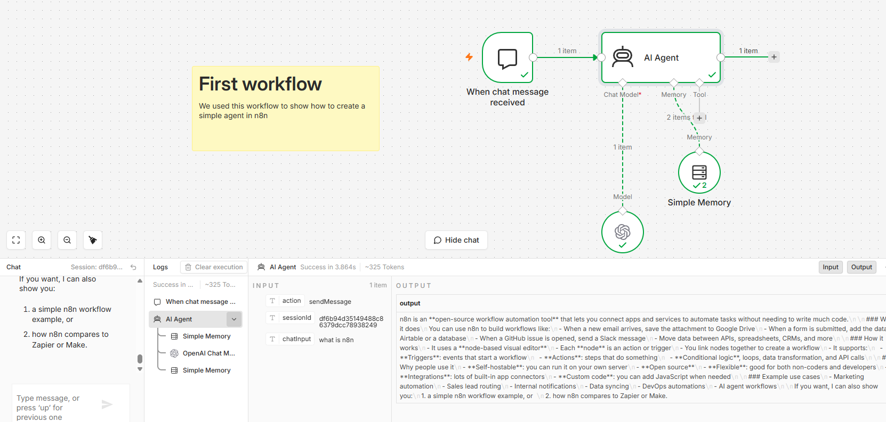

Confirm access to workflow1: Google Sheets in n8n

Some examples:

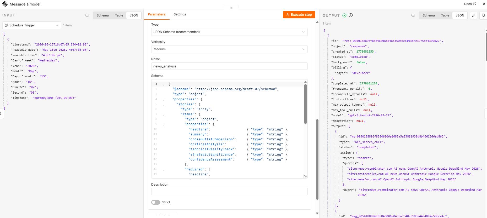
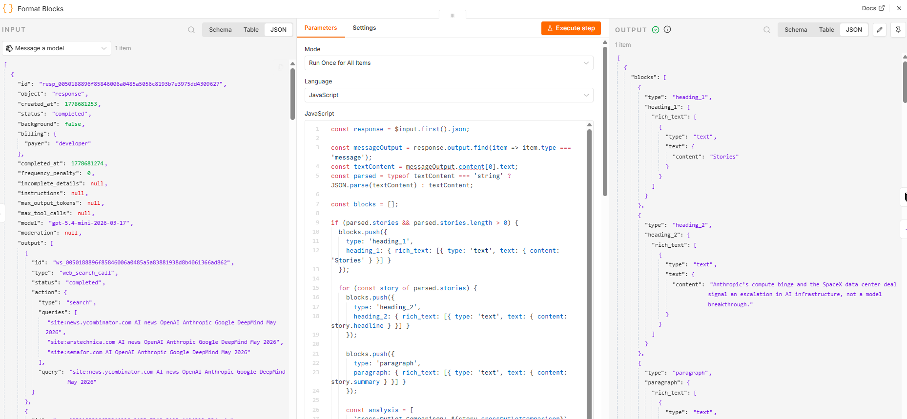
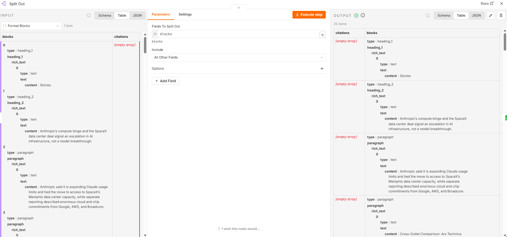


## Step3: Analyze Workflows and Document Nodes for Workflow2 (RAG)

**Workflow2:** Document Upload RAG Chatbot with Cohere Reranking - May 13th.json

### Testing nodes

### **First part: RAG Document Embedding & Storage Workflow**

**Node1: upload document form**

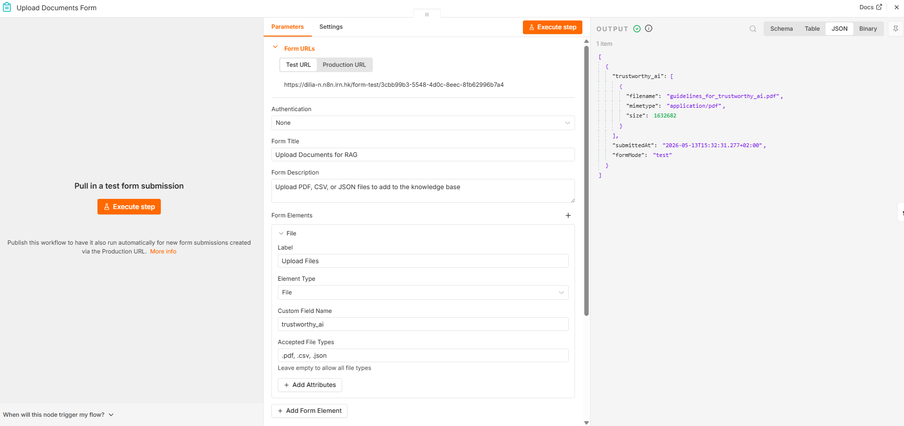


**Following Nodes: store in pincone/ document loader/ text splitter/OpenAI embeddings** 

Settings:

* Embedding settings: text-embedding-3-small / Dimension: 1536
* Pinecone credentials/ Pinecone index (selected the field I created when uploading the pdf)/ Embedding batch size: 200
* Document loader: type of data: JSON

=> In the node `store in pincone` the input always changes to binary. After that all inputs and outputs remain in JSON format.

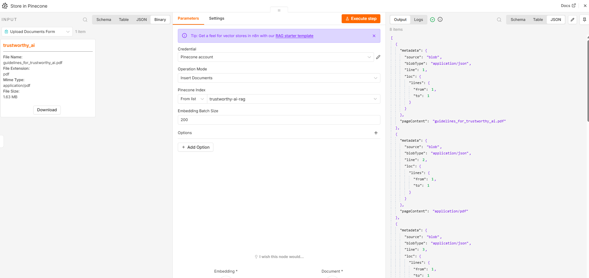

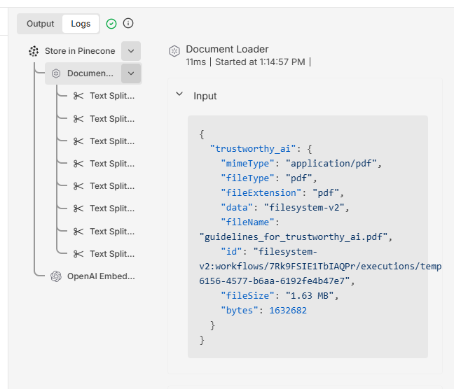

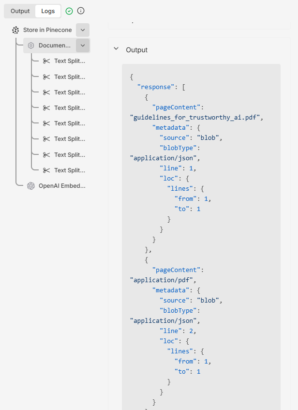

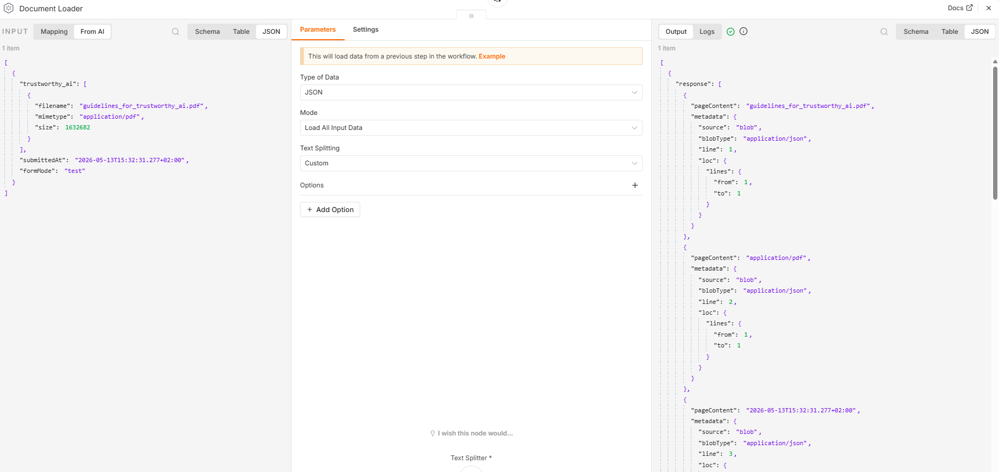

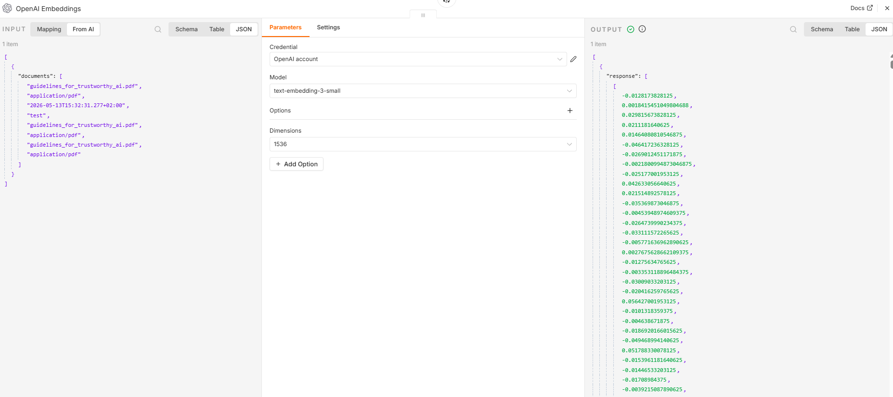

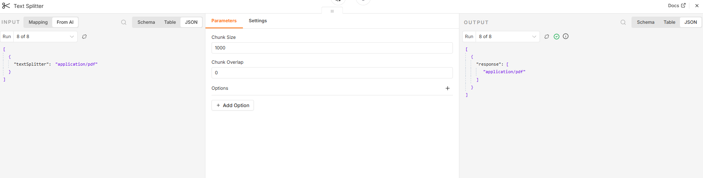


**First part successfully executed:**

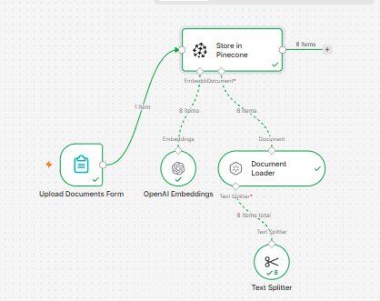


**Node Overview**

| Node | Role |
|---|---|
| **Upload Documents Form** | Entry point — user submits a PDF file |
| **Document Loader** | Reads and parses the raw file into readable text |
| **Text Splitter** | Chunks the text into smaller pieces for better embedding quality |
| **OpenAI Embeddings** | Converts each chunk into a vector using `text-embedding-3-small` |
| **Store in Pinecone** | Persists the vectors + metadata to the Pinecone vector database |


### **Second part: RAG Query & Reranking Pipeline**

Settings:

* OpenAI Chat Model:

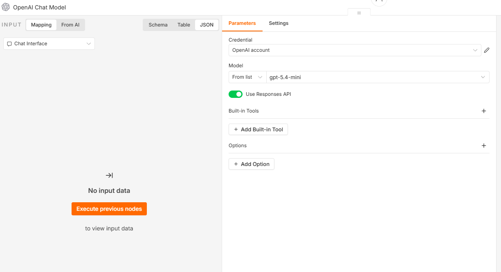

* Query embeddings: text-embedding-3-small / Dimension: 1536
* Cohere credentials. Model rerank-v3.5. N=3

### Testing nodes

### **NODE1: Chat interface**

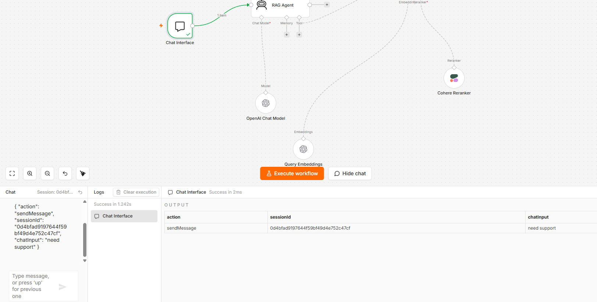

### **NDOE2: Retrieve from Pinecone**

* Pinecone Index: trustworthy-ai-rag (only one created in a former lab)

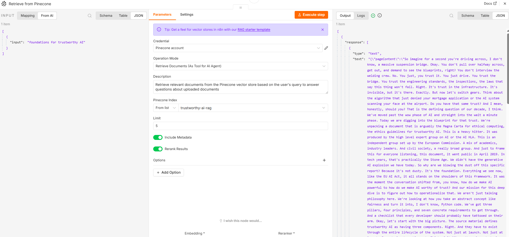

**Summary from JSON input and output:**

| Field | Input | Output | Change |
|---|---|---|---|
| `action` | `"sendMessage"` | ❌ not present | **Removed** |
| `sessionId` | `"fa73aed6..."` | ❌ not present | **Removed** |
| `chatInput` | `"what does privacy..."` | ❌ not present | **Removed** |
| `output` | ❌ not present | ✅ present (long text) | **Added** |

* The array wrapper `[ ]` is **preserved** ✅
* All 3 input fields were **consumed** by the agent and not passed through
* A single new `output` field was **generated** containing the agent's response
* The response includes **inline citations** (`**eu_ai_act.pdf**`) — system prompt instruction to cite sources is working ✅


### **NODE3: Cohere Reranker**

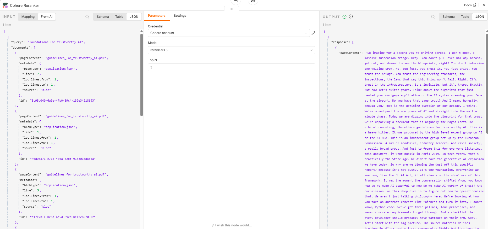

**INPUT:**

```json
[
  {
    "query": "string",
    "documents": [
      {
        "pageContent": "string",
        "metadata": { ... }
      }
    ]
  }
]
```

**OUTPUT:**

```json
[
  {
    "response": [
      {
        "pageContent": "string",
        "metadata": { ... }
      }
    ]
  }
]
```

**Summary from JSON input and output:**

| Field | Input | Output | Change |
|---|---|---|---|
| `query` | `"privacy and data governance include"` | ❌ not present | **Removed** |
| `documents` | ✅ array of chunks with `pageContent` + `metadata` | ❌ not present | **Removed** |
| `response` | ❌ not present | ✅ array of reranked chunks | **Added** |
| `pageContent` | ✅ present (inside documents) | ✅ present (inside response) | **Preserved** |
| `metadata` | ✅ present (inside documents) | ✅ present (inside response) | **Preserved & expanded** |


| Metadata Field | Input | Output | Change |
|---|---|---|---|
| `author` | ✅ | ✅ | Preserved |
| `chunk_char_count` | ✅ | ❌ | **Removed** |
| `chunk_id` | ✅ | ❌ | **Removed** |
| `chunk_index` | ✅ | ✅ | Preserved |
| `chunk_overlap` | ✅ | ❌ | **Removed** |
| `chunk_size` | ✅ | ❌ | **Removed** |
| `chunking_strategy` | ✅ | ❌ | **Removed** |
| `creationdate` | ✅ | ✅ | Preserved |
| `creator` | ✅ | ✅ | Preserved |
| `keywords` | ✅ | ✅ | Preserved |
| `moddate` | ✅ | ✅ | Preserved |
| `page` | ✅ | ✅ | Preserved |
| `page_label` | ✅ | ✅ | Preserved |
| `producer` | ✅ | ✅ | Preserved |
| `section` | ✅ | ✅ | Preserved |
| `source` | ✅ | ✅ | Preserved |
| `source_file` | ✅ | ✅ | Preserved |
| `source_type` | ✅ | ✅ | Preserved |
| `subject` | ✅ | ✅ | Preserved |
| `text_cleaning` | ✅ | ❌ | **Removed** |
| `title` | ✅ | ✅ | Preserved |
| `token_count` | ✅ | ✅ | Preserved |
| `total_chunks` | ✅ | ✅ | Preserved |

* **Top N is set to 3** — Cohere reduces the 5 retrieved chunks down to the **top 3 most relevant** ✅
* `query` and `documents` are consumed by Cohere and replaced with `response`
* Several chunking-related metadata fields are **stripped out** by Cohere (`chunk_char_count`, `chunk_id`, `chunk_overlap`, `chunk_size`, `chunking_strategy`, `text_cleaning`) — only content-relevant metadata is passed through
* `pageContent` and core metadata are **cleanly preserved** ✅
* Model used: **rerank-v3.5** ✅


### **NODE4:OpenAI Chat Model**

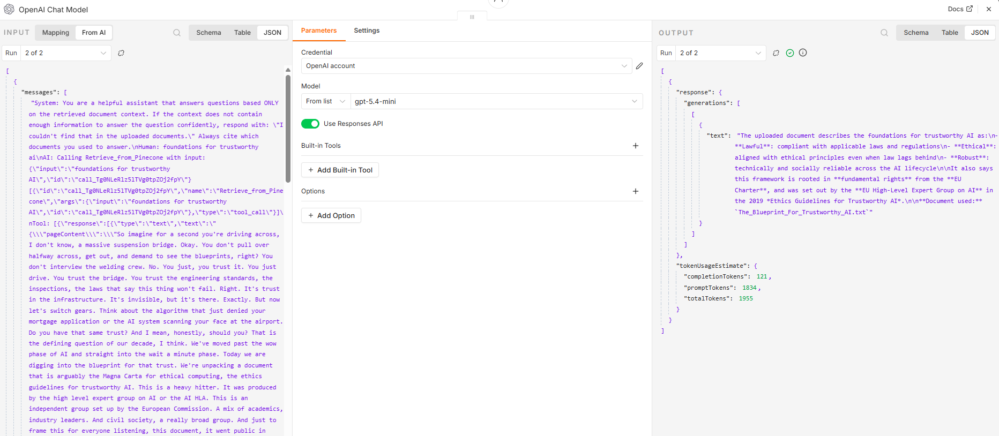

**INPUT:**

```json
[
  {
    "messages": ["string (full conversation history)"],
    "estimatedTokens": "number",
    "options": {
      "model": "string",
      "max_retries": "number",
      "configuration": { ... },
      "use_responses_api": "boolean"
    }
  }
]
```
**OUTPUT:**

```json
[
  {
    "response": {
      "generations": [
        [
          {
            "text": "string (final answer)"
          }
        ]
      ]
    },
    "tokenUsageEstimate": {
      "completionTokens": "number",
      "promptTokens": "number",
      "totalTokens": "number"
    }
  }
]
```

**Summary from JSON input and output:**

| Field | Input | Output | Change |
|---|---|---|---|
| `messages` | ✅ array (system prompt + human + AI + tool messages) | ❌ not present | **Removed** |
| `estimatedTokens` | ✅ `1965` | ❌ not present | **Removed** |
| `options` | ✅ model config object | ❌ not present | **Removed** |
| `response` | ❌ not present | ✅ nested generations object | **Added** |
| `tokenUsageEstimate` | ❌ not present | ✅ token breakdown object | **Added** |

**Token Usage**

| Metric | Value |
|---|---|
| `promptTokens` | 1,965 |
| `completionTokens` | 164 |
| `totalTokens` | 2,129 |

* Model used: **gpt-5.4-mini** via `https://api.openai.com/v1` ✅
* Input `messages` contains the **full conversation chain**: system prompt → human query → AI tool call → Pinecone tool result
* Output `generations` is a **double-nested array** `[[{...}]]` — this is LangChain's standard generations format
* The final `text` field contains the **clean, formatted answer** with bullet points and source citation (`eu_ai_act.pdf`) ✅
* `estimatedTokens` (1,965) in input matches `promptTokens` (1,965) in output — confirming accurate token estimation ✅
* `use_responses_api: true` indicates the node is using OpenAI's newer Responses API format

### **NODE5: Query Embeddings**


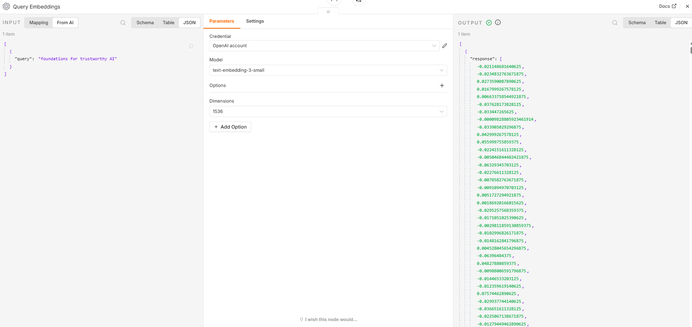

**INPUT:**
```json
[
  {
    "query": "string"
  }
]
```

**OUTPUT:**

```json
[
  {
    "response": [
      "float", "float", "float" ... (1536 values total)
    ]
  }
]
```


**Summary from JSON input and output:**

| Field | Input | Output | Change |
|---|---|---|---|
| `query` | ✅ `"privacy and data governance include"` | ❌ not present | **Removed** |
| `response` | ❌ not present | ✅ array of float numbers | **Added** |

* Model used: **text-embedding-3-small** ✅
* Dimensions set to **1536** 
* The output `response` is a **dense vector** — an array of 1,536 floating point numbers representing the semantic meaning of the query
* This is the vector that gets sent to Pinecone to find the most similar stored document chunks
* The transformation is: **human-readable text → numerical vector** — a complete data type change from `string` to `array of floats`


### **NODE6: RAG Agent**

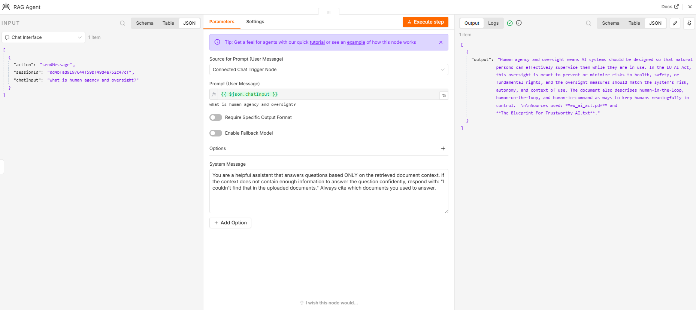


**INPUT:**

[
  {
    "action": "sendMessage",
    "sessionId": "fa73aed6deb74a3c8182ec96fd755f41",
    "chatInput": "what does privacy and data governance include"
  }
]

**OUTPUT:**

[
  {
    "output": "Privacy and data governance include:\n\n- Ensuring the right to privacy and protection of personal data throughout the AI system lifecycle\n- Applying data minimisation and data protection by design and by default\n- Using measures such as anonymisation and encryption\n- Using technology that allows algorithms to be brought to the data, so AI can be trained without transferring or copying raw/structured data\n- For training, validation, and testing data sets: making them relevant, sufficiently representative, as error-free and complete as possible\n- Including transparency about the original purpose of personal data collection\n- Ensuring datasets have appropriate statistical properties and mitigating biases that could affect health, safety, fundamental rights, or lead to discrimination\n\nUsed document: **eu_ai_act.pdf** (EU AI Act, Regulation (EU) 2024/1689)."
  }
]

* **Analysis JSON input and output:**

Input structure:

[
  {
    "action": "string",
    "sessionId": "string",
    "chatInput": "string"
  }
]

Output structure:
[
  {
    "output": "string"
  }
]


**Summary from JSON input and output:**

* The array wrapper [ ] is preserved ✅
* All 3 input fields were consumed by the agent and not passed through
* A single new output field was generated containing the agent's response
* The response includes inline citations (**eu_ai_act.pdf**) — meaning your system prompt instruction to cite sources is working ✅

| Field | Input | Output | Change |
|---|---|---|---|
| `action` | `"sendMessage"` | ❌ not present | **Removed** |
| `sessionId` | `"fa73aed6..."` | ❌ not present | **Removed** |
| `chatInput` | `"what does privacy..."` | ❌ not present | **Removed** |
| `output` | ❌ not present | ✅ present (long text) | **Added** |


**Second part successfully tested:**

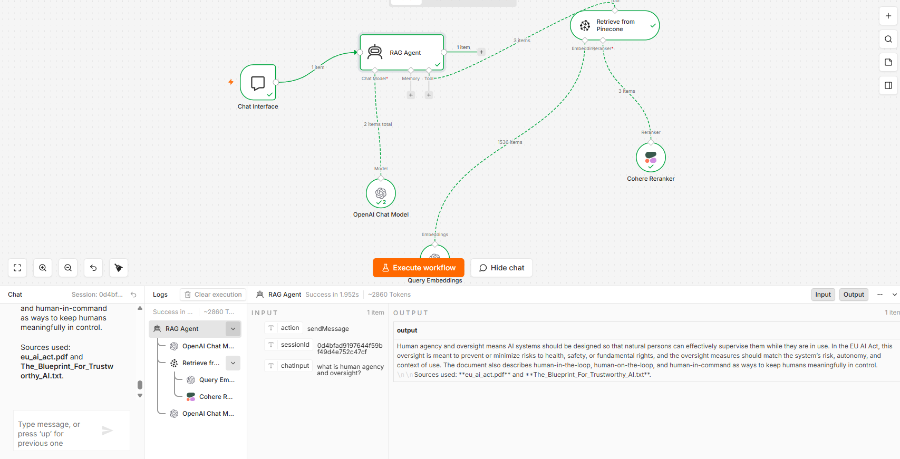


### **Node Overview**

| Node | Role |
|---|---|
| **Chat Interface** | Entry point — receives the user's question |
| **RAG Agent** | Orchestrates the full retrieval and response pipeline |
| **OpenAI Chat Model** | Generates the final natural language answer |
| **Query Embeddings** | Converts the user's question into a vector for similarity search |
| **Retrieve from Pinecone** | Fetches the most semantically similar document chunks |
| **Cohere Reranker** | Re-scores and reorders retrieved chunks for better relevance before answering |


